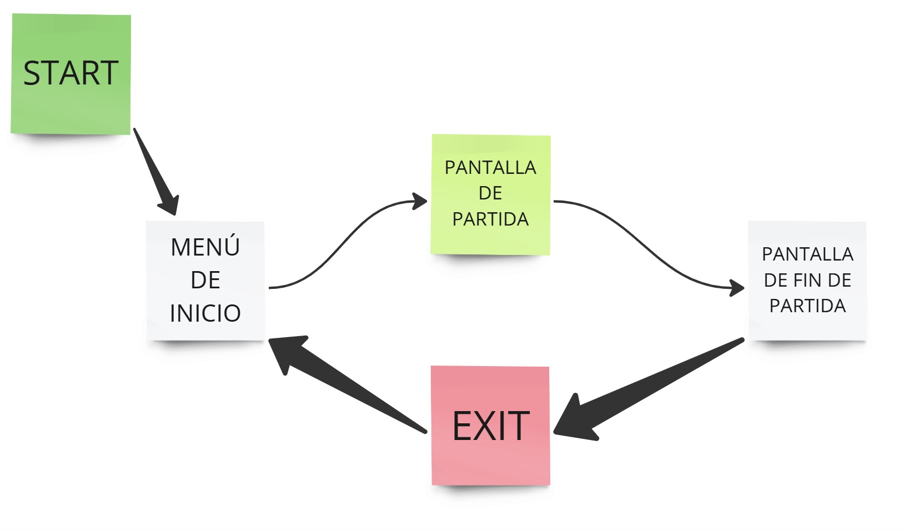
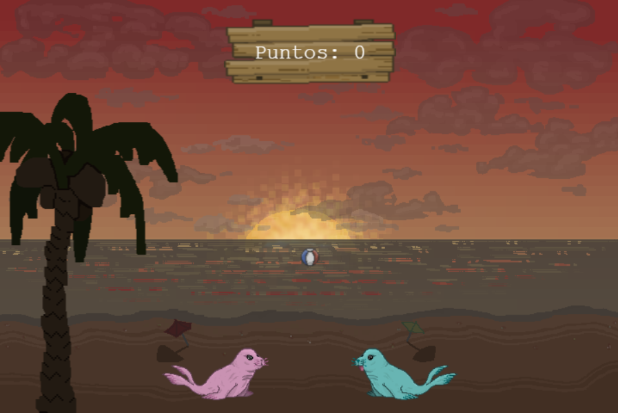
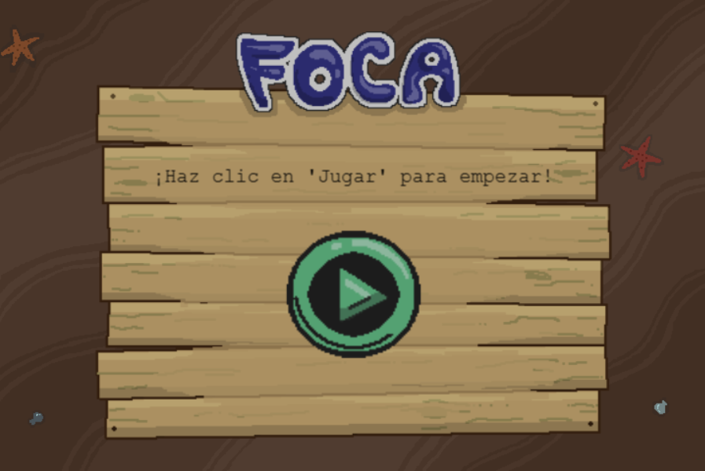
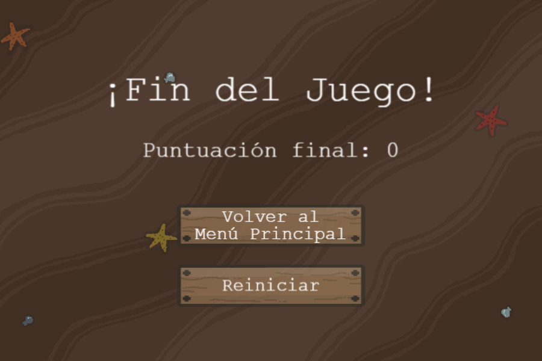

# GDD - F.O.C.A.: Felicidad y Ocio Con Amigos

Tarso da Costa da Silva
Juan Carlos Mauricio Orejón
Álvaro Codorníu Alonso
Diego Gómez Martín

## Introducción:
 La elección del tipo de videojuego ha venido inicialmente dada por la decisión de hacer un juego multijugador cooperativo. Creemos que da opciones interesantes y un estilo de juego relajado y ameno, además de ahorrarnos la calibración del componente competitivo. Posteriormente, la idea del juego evolucionó hasta una especie de pong, tomando como referencia el juego Lethal League, que ha sido nuestra principal inspiración. Por último, se decidió caracterizar a los jugadores como focas que juegan a la pelota y hacerlo en un tono gracioso.

## Concepto:
 Juego cooperativo de dos jugadores cuyo objetivo será mantener una pelota en el aire golpeándola una vez cada uno, acumulando puntuación hasta que la pelota toque el suelo. El juego será dinámico y fluido, con unas reglas y una curva de aprendizaje sencillas y recompensará la coordinación entre los dos jugadores, quienes deberán hacer uso de sus reflejos y mover correctamente a su personaje para evitar que la pelota toque el suelo durante el mayor tiempo posible. Todo ello se desarrolla en un contexto amigable y en tono divertido, con una estética colorida y animaciones llamativas que enfatizan el carácter casual del juego. El juego será tipo *arcade*, lo que quiere decir que se desarrollará por partidas sueltas en las que se guardará la puntuación de los dos jugadores que han participado.

## Género:
 Juego con mecánicas similares a los videojuegos *arcade*. Es de estilo cooperativo, con partidas dinámicas y de duración indefinida, donde se trata de conseguir una puntuación alta y batir el récord. Conceptualmente, mezcla elementos de juegos *arcade*, plataformas 2D y de deportes.

## Plataformas:
 El juego se desarrollará para PC, para redes locales y mediante un servidor web que utilizará, por tanto, HTML y JavaScript. En el propio juego se dará la opción de jugar en un mismo dispositivo o en varios dispositivos conectados a una misma subred.

## Jugabilidad

### Espacio:
 Las partidas se desarrollarán en un escenario 2d ligeramente más grande que la pantalla de juego, por lo que los dos jugadores siempre se ven en pantalla. La cámara se mantiene estática independientemente del movimiento de los jugadores. La pelota podrá rebotar en los laterales de la pantalla si esta está cerrada en ese nivel, así como en el techo o en otros elementos de la escena. La única condición para perder es que la pelota toque el suelo. A veces, otras condiciones llevan igualmente a la derrota por extensión, como por ejemplo el caso en que el jugador se caiga en uno de los agujeros del segundo nivel (glaciar), en cuyo caso no podrá ir a dar a la pelota y por tanto tocará el suelo. También en los casos en que la pelota salga demasiado de pantalla (cuando el mapa esté abierto), lo más probable es que el jugador no pueda darle y acabe perdiendo la partida.
 
### Controles:
 Se utilizará el ratón para navegar por los diferentes menús e interactuar con los botones y elementos del juego; no obstante, durante la partida será necesario únicamente el uso del teclado para jugar. Se utilizarán las flechas o las teclas WASD para el movimiento vertical y horizontal, mientras que para los golpes se usarán los números. En el caso de que 2 jugadores estén jugando en un mismo dispositivo, uno de ellos se moverá con flechas y el otro con las teclas WASD. Los golpes se corresponderán con las teclas 1, 2 y 3 para el jugador de la derecha y 7, 8 y 9 para el jugador de la izquierda. También habrá opciones de personalización de controles para adaptarse al teclado de cada ordenador y a las necesidades o preferencias específicas de cada jugador.

### Mecánicas:

- Desplazamiento lateral: el movimiento es uno de los elementos básicos que sienta las bases del resto del juego. El jugador deberá tener un movimiento preciso y unos reflejos rápidos para no caer en los obstáculos del terreno, así como para anticiparse a la trayectoria de la pelota y poder darle antes de que alcance el suelo. No existen colisiones entre jugadores, por lo que podrán moverse libremente por el escenario sin limitaciones. Así, algunas veces será necesario esquivar obstáculos, golpear la pelota en el aire, golpear la pelota en una dirección determinada o con cierta intensidad…

- Salto (desplazamiento vertical): El salto complementa al desplazamiento lateral, dotando al jugador de la movilidad completa necesaria para esquivar obstáculos del terreno o enemigos y para poder golpear la pelota en más situaciones.

- Golpes: Hay tres tipos de golpes diferentes: golpe normal, golpe fuerte y globo. Los golpes normales van en línea recta en la dirección en la que mire el personaje, mientras que los golpes fuertes van ligeramente inclinados hacia abajo y a más velocidad. Por otra parte, el globo lanza la pelota hacia arriba y con una velocidad reducida, así que es una manera de ponerle fácil al compañero el siguiente toque. La complicación de esta mecánica consiste en saber qué tipo de golpe usar en cada momento para optimizar la puntuación conseguida, teniendo en cuenta que . La idea principal consiste en golpear la pelota en el momento justo de la colisión entre esta y el jugador, si el jugador presiona el botón de golpe demasiado pronto o demasiado tarde, la pelota pasará de largo. Además, el impacto dirigirá la pelota hacia el sentido al que apunta el jugador, combinando así esta mecánica con la del movimiento. Dinámicas, progresión y flujo de juego Las partidas son de duración indefinida con aumento progresivo de la dificultad y diferentes niveles lineales, por lo que comparte bastantes características con el estilo y el flujo de juego de los videojuegos *arcade*. El principal objetivo es conseguir la máxima puntuación posible y batir el récord. Para ello, cada toque aportará puntuación a los jugadores de la siguiente manera: Los golpes normales contarán como 1 punto. Los golpes fuertes cuentan como 2 puntos. Los globos no aportan puntuación. Los golpes en el aire aportan +1 puntos (además del tipo de golpe). Esto fomenta el estilo de juego arriesgado de los jugadores, para que eviten quedarse lo más quietos posibles golpeando la pelota con globos. También se incluirán obstáculos y eventos de nivel para evitar dicho comportamiento pasivo del jugador. La pelota irá aumentando su velocidad conforme vaya avanzando la partida, de forma discreta y ofreciendo *feedback* de ello al jugador. Es decir, cada 60 segundos, la velocidad aumentará ligeramente y se le informará a los jugadores mediante una animación y un efecto de sonido que le alerten. La pelota rebotará en las paredes y techo del nivel en cuestión, así como con los posibles obstáculos que pueda haber. Si entra en contacto con el suelo, los jugadores perderán y acabará la partida inmediatamente.

### Dinámicas, progresión y flujo de juego

Las partidas son de duración indefinida con aumento progresivo de la dificultad y diferentes niveles lineales, por lo que comparte bastantes características con el estilo y el flujo de juego de los videojuegos *arcade*.
El principal objetivo es conseguir la máxima puntuación posible y batir el récord. Para ello, cada toque aportará puntuación a los jugadores de la siguiente manera:
- Los golpes normales contarán como 1 punto.
- Los golpes fuertes cuentan como 2 puntos.
- Los globos no aportan puntuación.
- Los golpes en el aire aportan +1 puntos (además del tipo de golpe).

Esto fomenta el estilo de juego arriesgado de los jugadores, para que eviten quedarse lo más quietos posibles golpeando la pelota con globos. También se incluirán obstáculos y eventos de nivel para evitar dicho comportamiento pasivo del jugador. La pelota irá aumentando su velocidad conforme vaya avanzando la partida, de forma discreta y ofreciendo *feedback* de ello al jugador. Es decir, cada 60 segundos, la velocidad aumentará ligeramente y se le informará a los jugadores mediante una animación y un efecto de sonido que le alerten.
La pelota rebotará en las paredes y techo del nivel en cuestión, así como con los posibles obstáculos que pueda haber. Si entra en contacto con el suelo, los jugadores perderán y acabará la partida inmediatamente.

## Escenarios:
 Cada escenario tiene distintas situaciones y eventos que proporcionan variedad a la jugabilidad. Habrá 3 escenarios iniciales: nivel fácil, medio y difícil. En orden ascendente de dificultad, los escenarios son los siguientes:

1. Playa al atardecer: Nivel de poca dificultad y ambiente relajado, con un bonito atardecer de fondo y sin obstáculos, para jugadores que prefieran una partida más casual. Sirve prácticamente de tutorial del juego. La pelota rebotará en los laterales pero no habrá techo, por lo que la única forma de perder es si toca el suelo.
- Obstáculos: ninguno, ya que lo que se pretende es que el jugador se familiarice con el juego y las mecánicas.

2. Glaciar: Nivel de dificultad intermedia, con algunos elementos que ponen a prueba las habilidades del jugador sin llegar a ser un reto. La pelota no rebota en los laterales ni en el techo, por lo que si rebasa esos límites los jugadores habrán perdido.
- Obstáculos: el principal impedimento de este nivel de cara al movimiento de los jugadores es el suelo, que tendrá agujeros por los que estos se podrán caer, terminando así la partida. Además, el suelo será resbaladizo y, por tanto, hará más inestable el movimiento del jugador.
- Evento: cada 30 segundos, caerán carámbanos de hielo que provocarán colisiones tanto con los jugadores como con la pelota durante 10 segundos.

3. Barco de crucero: Nivel de alta dificultad, pero también el desafío más atractivo para el jugador. Contiene muchos elementos frenéticos y estimulantes que ponen a prueba los nervios y los reflejos del jugador. La pelota rebota con múltiples estructuras del escenario, pero no por los laterales ni por arriba, por lo que si se sale los jugadores perderán.
- Obstáculos: el barco contiene varios niveles, por lo que la pelota podrá rebotar en diferentes estructuras a diferentes alturas. El jugador también tendrá que sortear dichos obstáculos, así como a los pasajeros del crucero quienes corren de un lado a otro y con los cuales colisiona.
- Evento: Cada 20 segundos hay turbulencias, y el barco se inclina lentamente primero hacia un lado y luego hacia el otro. Tras 5 segundos en cada dirección, vuelve a su posición inicial.

## Personajes:
 Los personajes jugables son dos focas que utilizarán su cola a modo de raqueta para pegarle a la pelota. A nivel jugable las focas son iguales. Con la puntuación que el jugador consiga en las partidas va a poder desbloquear pequeñas mejoras, las cuales podrá seleccionar antes de empezar cada partida.

## Interfaces:
 El flujo de navegación entre pantallas y de cómo se relacionan entre sí las interfaces se muestra en el siguiente diagrama:
 
 ### Interfaz de partida:
 El principal objetivo de la interfaz en partida es que sea simple e intuitiva. El juego está diseñado para ser frenético, por lo que una interfaz con muchos elementos en pantalla sería perjudicial para la experiencia que queremos conseguir. La puntuación de la partida está arriba en el medio de la pantalla, es importante que esté arriba ya que el suelo es una zona crítica para el jugador, tanto para su movilidad como para no dejar caer la pelota. Cuando el jugador da un toque al balón, el número del toque actual aparece en en el fondo del escenario, hemos tomado esta decisión porque el número de toques es un elemento importante del juego pero no es imprescindible por lo que tener todo el tiempo en pantalla solo generaría más ruido visual, así los jugadores pueden mantener la cuenta de los toques que llevan sin que les moleste.
 
 ### Menú inicial
 El menú inicial es sencillo y cuenta únicamente con un botón de inicio para empezar la partida. En un futuro se ampliará con los botones necesarios para las funcionalidades que se implementen (por ejemplo elección de nivel).
 
 ### Pantalla fin de partida
 Pantalla tras finalizar la partida, se muestra la puntuación obtenida y los botones para empezar otra partida o salir del juego.
 

## Estilo artístico:
 El estilo visual será en 2 dimensiones, con un tipo de pixel art lo suficientemente sencillo para facilitar el trabajo y la creación de sprite sheets, pero con suficiente resolución como para poder ver con claridad los personajes y demás elementos. Además hemos elegido este estilo visual también por afinidad con el mismo y porque se adapta a las sensaciones que queremos que nuestro juego transmita. Tiene que ser un juego desenfadado, divertido y dinámico, por lo que los personajes tenderán a ser graciosos, las animaciones vistosas y la paleta de color con tonos vivos y enérgicos.

## Música y sonido:
 La música y efectos de sonido van a ser animadas y frenéticas para adecuarse a la temática del juego. A continuación se detalla una lista de los efectos de sonido que se necesitarán. Se numerarán a efectos prácticos:

| NÚMERO | DESCRIPCIÓN | BUCLE | ASOCIADO A |
|--------------|--------------|--------------|--------------|
|1|Sonido de fondo para el menú principal. Música tipo arcade, repetitiva pero pegadiga y frenética|SI|Pantalla de inicio|
|2|Efecto de sonido de botón para los menús.|NO|Botones de menú|
|3|Música de fondo para los menús de selección.|SI|Menú de selección de personaje y menú de selección de nivel|
|4|Efecto de sonido sencillo para flechas de selección.|NO|Flechas de selección|
|5|Gritos de fondo para el efecto de cuenta atrás previo al comienzo del juego.|NO|Cuenta atrás comienzo partida|
|6|Efecto de bocina estridente posterior a la cuenta atrás.|NO|Comienzo inminente de partida|
|7|Música de fondo para el nivel 1, relajada.|SI|Escenario “playa atardecer”|
|8|Música de fondo para el nivel 2, alegre.|SI|Escenario "glaciar"|
|9|Música de fondo para el nivel 3, frenética|SI|Escenario “barco crucero”|
|10|Sonido de gaviotas de fondo.|SI|Escenario “playa atardecer”|
|11|Sonido de oleaje de fondo.|SI|Escenario “playa atardecer” y escenario “glaciar”|
|12|Bullicio de gente de fondo.|SI|Escenario “barco crucero”|
|13|Grito histérico de persona.|NO|NPC de crucero huyendo de jugador|
|14|Bote de pelota. Sonido tipo dibujo animado.|NO|Rebote de pelota contra jugadores o contra elemento del escenario|
|15|Gritos de reacción similares a los de unas gradas cuando se mete un gol, pero más corto.|NO|Un jugador golpea la pelota|
|16|Gritos colectivos de euforia.|NO|Los jugadores llegan a un número de toques redondo (10, 20, 30…)|
|17|Gritos de desilusión colectivos.|NO|La pelota toca el suelo y los jugadores pierden|
|18|Sonido tipo dibujo animado de andar o moverse.|SI|Movimiento de los jugadores|
|19|Música de fondo para la pantalla de ranking.|SI|Pantalla de tabla de puntuaciones|

## Bibliografía
 Serie de vídeotutoriales de Phaser: https://www.youtube.com/watch?list=PLL_H5w4KA8dP9pPayzYxHCD4IQ80nkfY9&v=4RaN4g9KzDo
 Juego básico con Phaser gamedevacademy: https://gamedevacademy.org/phaser-3-tutorial/
 Guía de ininiación de la página de Phaser: https://phaser.io/tutorials/getting-started-phaser3
 Guía de cómo crear un juego de la página de Phaser: https://phaser.io/tutorials/making-your-first-phaser-3-game-spanish
